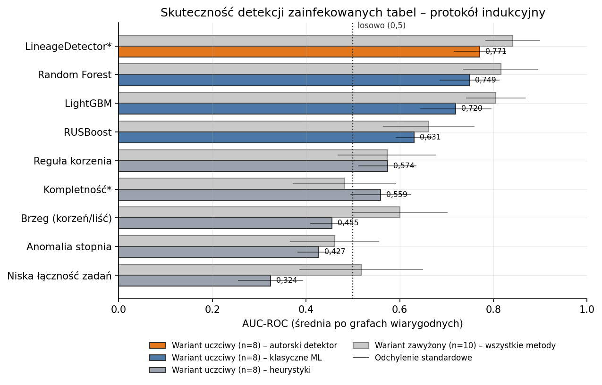

# Odkrywanie zależności między obiektami w bazie danych

Praca magisterska — Maria Nowicka (151851)
Politechnika Poznańska, Wydział Informatyki i Telekomunikacji
Promotor: prof. dr hab. inż. Robert Wrembel, 2026

## Temat

Detekcja **węzłów o zerwanym lineage** (*broken lineage*) w rzeczywistych
grafach pochodzenia danych, wyłącznie na podstawie **topologii grafu**,
bez dostępu do nazw obiektów, schematów czy wartości danych.

*Broken lineage* to przerwanie ciągłości grafu zależności przez tabele
tymczasowe (znikają po zakończeniu ETL) i funkcje UDF (ukrywają logikę
przepływu). Tabela dotknięta zjawiskiem traci widocznego producenta lub
konsumenta danych. W pracy nazywam ją **zainfekowaną** (ang. *infected*).

Zadanie sformułowałam jako **ranking**: każda tabela otrzymuje skalibrowane
prawdopodobieństwo p(zainfekowana), a tabele z czoła listy trafiają do
ręcznej inspekcji. Dotychczasowe prace (w tym zespołu promotora) modelują
broken lineage jako *predykcję krawędzi*. Detekcja na poziomie węzłów jest
luką, którą wypełnia ta praca (*topology-only baseline*).

Praca przeszła **zmianę koncepcji** (2026-06, po konsultacji z dr. P. Misiorkiem).
Pierwotna predykcja konkretnych brakujących krawędzi okazała się na rzadkich,
zanonimizowanych grafach DLG-DG-23 zadaniem ≈losowym (szczegóły niżej,
sekcja „Badanie wstępne"). Snapshot starego podejścia: tag `magisterka_old`,
gałąź `edge-prediction-archive`.

## Główny wynik

<p align="center">
  
</p>

**LineageDetector (wkład własny) osiąga AUC-ROC 0,771 / AUC-PR 0,435,
najlepszy wynik na wszystkich metrykach** w uczciwym, indukcyjnym protokole
(trening na 17 grafach, test na grafie niewidzianym). Sama topologia grafu
niesie umiarkowany, ale użyteczny sygnał o broken lineage, o ile cechy połączy
się w model uczony. Pojedyncze reguły heurystyczne nie wystarczają.

## Metodyka w pigułce

1. **Symulacja:** z grafu usuwam 10% *jobów łączących* (mających wejścia
   i wyjścia `DATA_FLOW`); tabele incydentne do usuniętych jobów = zainfekowane
   (etykiety referencyjne). 3 powtórzenia (seedy 42–44).
2. **Kontrola przecieku:** po usunięciu joba ~29% zainfekowanych tabel staje
   się DATA_FLOW-izolowanych (0% czystych), więc trywialna reguła
   „izolowana ⟹ zainfekowana" zawyża każdy wynik. Flaga `--exclude-isolated`
   usuwa izolowane z ewaluacji, co daje **wariant uczciwy** (główny); wariant
   bez flagi (**napompowany**) raportuję dla kontrastu.
3. **Protokół indukcyjny** leave-one-graph-out: model nigdy nie widzi grafu
   testowego. Do średnich wchodzą tylko grafy *wiarygodne* (≥5 zainfekowanych
   w teście, `MIN_POS=5`): uczciwy ma 8 grafów, napompowany 10 (wykluczenie
   izolowanych zabiera pozytywy i 2 grafy spadają poniżej progu, dlatego
   wariantów **nie porównuje się 1:1**).
4. **Metryki rankingowe:** AUC-ROC, AUC-PR, Precision@k, Brier. Przy częstości
   pozytywów ~10–14% metryką główną jest AUC-PR (losowy klasyfikator ma
   AUC-PR ≈ częstość pozytywów, czyli ~0,13, a nie 0,5!). W tym biegu
   k = liczba zainfekowanych, więc P@k = R@k = Hits@k.

## Zaimplementowane algorytmy

### Heurystyki strukturalne (bez uczenia — baseline)

| Heurystyka | Idea |
|---|---|
| `degree_anomaly` | score = 1/(1+deg); tabela po utracie joba ma mniej połączeń |
| `boundary` | is_root + is_leaf; zerwanie wypycha tabelę na brzeg grafu |
| `low_job_connectivity` | 1/(1+liczba sąsiednich jobów) |
| `rule_root` | is_root (in_df=0); celowo trywialny punkt odniesienia |
| **`completeness`** ★ | **peer-consistency (wkład własny)**, patrz niżej |

**Peer-consistency:** tabela o zerwanym lineage jest *strukturalnie niespójna*
z sąsiadami. Tabela-korzeń jest podejrzana, jeśli jej „peerzy" (inne tabele
wpadające do tych samych downstream-jobów) **mają** producentów, a ona nie,
bo prawdziwe źródło zwykle sąsiaduje z innymi źródłami. Symetrycznie dla liści.
To sygnał relacyjny (o otoczeniu), jakościowo inny niż lokalny stopień węzła.

Klasyczne miary link-prediction (Common Neighbors, Jaccard, Adamic-Adar) są
nieaplikowalne: graf przepływu job–tabela jest dwudzielny, węzły tego samego
typu nie mają wspólnych sąsiadów. Podobieństwo nazw (Jaro-Winkler) odpada
przez anonimizację (UUID).

### Klasyczne ML (na 13 cechach topologicznych węzła)

Random Forest, RUSBoost (nawiązanie do Boiński i in. 2025) i LightGBM
w binarnej klasyfikacji węzła, `class_weight=balanced`. Cechy opisują pozycję
tabeli w DAG przepływu: `in_df`, `out_df`, `degree`, `role`, `flow_depth`,
`flow_reach`, `depth+reach`, `is_root`, `is_leaf`, `n_field_children`,
`n_job_neighbors`, `avg_job_in_df`, `avg_job_out_df`.

### LineageDetector ★ (wkład główny)

```
[13 cech pozycji w DAG ⊕ 3 cechy peer-consistency]
      → RandomForest (300 drzew, class_weight=balanced)
      → kalibracja izotoniczna (CalibratedClassifierCV, cv=3)
      → p(zainfekowana)
```

Kalibracja sprawia, że wyjście jest *rzeczywistym prawdopodobieństwem*
(najlepszy Brier), co w praktyce pozwala ustawić próg alarmu. Konstrukcja
wspiera ablacje: `calibrate=False`, `use_completeness=False`.

**Node2Vec wykluczony świadomie:** embeddingi uczone per graf są
transduktywne, czyli geometrycznie nieporównywalne między grafami, więc nie
działają w protokole indukcyjnym. Ten wynik motywuje indukcyjne GNN
(GraphSAGE / R-GCN / HGT) jako dalszy krok; nie jest to luka.

## Wyniki: bieg kanoniczny

Ustawienia: 18 grafów DLG-DG-23, `removal_ratio=0.10`, `side=both`,
seedy 42–44, indukcyjny leave-one-graph-out, `MIN_POS=5`.
Źródło: [`results/README_BIEG_KANONICZNY.md`](results/README_BIEG_KANONICZNY.md).

### Wariant uczciwy (`--exclude-isolated`) — GŁÓWNY, 8 grafów wiarygodnych

| Metoda | AUC-ROC | AUC-PR | P@k | Brier ↓ |
|---|---:|---:|---:|---:|
| Niska łączność jobów | 0,324 | 0,112 | 0,094 | 0,226 |
| Anomalia stopnia | 0,427 | 0,165 | 0,142 | 0,134 |
| Brzeg (korzeń/liść) | 0,455 | 0,137 | 0,146 | 0,745 |
| Kompletność ★ | 0,559 | 0,206 | 0,240 | 0,144 |
| Reguła korzenia | 0,574 | 0,168 | 0,180 | 0,469 |
| RUSBoost | 0,631 | 0,249 | 0,340 | 0,152 |
| LightGBM | 0,720 | 0,381 | 0,398 | 0,147 |
| Random Forest | 0,749 | 0,425 | 0,380 | 0,117 |
| **LineageDetector ★** | **0,771** | **0,435** | **0,443** | **0,106** |

★ = wkład własny. Losowy klasyfikator: AUC-ROC = 0,5; AUC-PR ≈ 0,13
(częstość pozytywów), więc wynik 0,435 to ok. 3–4× powyżej losowego.

### Wariant napompowany (kontrast) — 10 grafów wiarygodnych

| Metoda | AUC-ROC (napompowany) | AUC-ROC (uczciwy) |
|---|---:|---:|
| Brzeg (korzeń/liść) | 0,600 | 0,455 |
| Niska łączność jobów | 0,518 | 0,324 |
| Random Forest | 0,816 | 0,749 |
| LightGBM | 0,805 | 0,720 |
| LineageDetector ★ | 0,842 | 0,771 |

Heurystyki brzeg/łączność „żyły z przecieku": po jego odcięciu spadają
**poniżej losowego**. ML i detektor trzymają poziom, ich sygnał jest realny.
(Uwaga: warianty uśredniam po różnych zbiorach grafów, 8 vs 10, więc
liczb nie wolno odejmować 1:1.)

### Analiza wrażliwości na `removal_ratio` (uczciwy, indukcyjny)

| Metoda | r=0,05 | r=0,10 | r=0,20 | r=0,30 |
|---|---:|---:|---:|---:|
| LineageDetector ★ | 0,761 | 0,771 | 0,755 | 0,754 |
| Random Forest | 0,760 | 0,749 | 0,755 | 0,756 |
| LightGBM | 0,706 | 0,720 | 0,742 | 0,761 |
| Kompletność ★ | 0,554 | 0,559 | 0,560 | 0,532 |

Wynik detektora jest praktycznie płaski, więc nie jest artefaktem wyboru
odsetka usuwanych jobów.

### Warianty dodatkowe

| Eksperyment | Wynik | Wniosek |
|---|---|---|
| Jeden job na instancję (minimalny sygnał) | RF 0,796, LD 0,794 (AUC-ROC); **LD Brier 0,042** (najlepszy) | ranking ≈ remis z RF; przewaga LD = jakość prawdopodobieństw |
| Transduktywny (podział węzłów w obrębie grafu) | RF ~0,82 | górna granica; łatwiejszy niż indukcyjny |
| Generalizacja skali (małe+średnie → duże) | RF ~0,63 | transfer na większe grafy trudniejszy niż LOO |

## Wnioski

1. **Sama topologia niesie użyteczny sygnał o broken lineage**, ale dopiero
   w modelu uczonym łączącym wiele cech (LineageDetector 0,771); pojedyncze
   reguły strukturalne po odcięciu przecieku są ≈losowe (0,32–0,57).
2. **Peer-consistency działa:** jako samodzielna heurystyka jest najlepsza
   (0,559), a dołożona do cech lokalnych podnosi wynik ponad czysty RF
   (0,771 vs 0,749). Sygnał relacyjny uzupełnia lokalny.
3. **Kalibracja ma wartość praktyczną:** najlepszy Brier (0,106; w wariancie
   jednojob 0,042) oznacza wiarygodne p(zainfekowana), a więc możliwość
   ustawienia progu alarmu w narzędziu data governance.
4. **Kontrola przecieku jest konieczna:** bez `exclude_isolated` wyniki są
   zawyżone, a heurystyki brzegowe fałszywie wyglądają na skuteczne.
5. **Główna trudność zadania:** osierocona tabela-następnik (in_df=0) wygląda
   topologicznie jak prawdziwa tabela źródłowa. To naturalny sufit metod
   czysto topologicznych i motywacja dla sygnału semantycznego / GNN.
6. **Zastosowanie (triage):** przy bazie ~13% zainfekowanych przegląd top-k
   wg detektora trafia ~44% (P@k 0,443), czyli ~3,5× więcej znalezisk na
   godzinę pracy audytora. Metoda wymaga wyłącznie topologii, czyli jedynej
   informacji, którą firmy realnie zgadzają się udostępnić (por. anonimizacja
   DLG-DG-23).

## Badanie wstępne: predykcja krawędzi (zarchiwizowane)

Pierwotne zadanie: klasyfikacja binarna brakujących krawędzi (job, tabela)
w trzech scenariuszach broken lineage (**A** staging, **B** UDF, **C** data
mart). Wynik: tylko scenariusz B nielosowy (RUSBoost AUC-ROC ≈ 0,70),
A/C ≈ 0,5. Przyczyna: rzadkość grafów (np. DLG1: 298 węzłów, 24 krawędzie
DATA_FLOW) oraz brak semantyki nazw (UUID). Wniosek, który motywuje pivot,
jest spójny z wynikiem zespołu promotora (Dutkiewicz, Misiorek, Wrembel,
EDBT/ICDT WS 2026): ich KG-GNN na scenariuszu *temporary tables* osiąga
AUROC 0,49 (≈losowo).

```bash
python scripts/run_scenario_experiments.py --all   # stare eksperymenty A/B/C
git checkout edge-prediction-archive               # pełny snapshot sprzed pivotu
```

## Dataset

**DLG-DG-23** — 18 rzeczywistych grafów lineage z Huawei Cloud
(Chen et al., *An open dataset of data lineage graphs for data governance
research*, Visual Informatics 2024).

- Repozytorium: <https://github.com/csuvis/DataAssetGraphData>
- 18 grafów skierowanych, 278–17 085 węzłów
- Typy węzłów: `Data Table`, `Data Job`, `Data Field`
- Typy krawędzi: `DATA_FLOW` (Table↔Job), `PARENT_CHILD` (Table→Field)

Dataset nie jest częścią repozytorium (katalog `data/` w `.gitignore`):

```bash
git clone https://github.com/csuvis/DataAssetGraphData.git \
          data/raw/DataAssetGraphData
# następnie wypakuj Node.rar i Edge.rar do data/raw/DataAssetGraphData/extracted/
```

## Środowisko i uruchomienie

Python 3.10; zależności: `networkx`, `numpy`, `scikit-learn`,
`imbalanced-learn`, `lightgbm`, `pytest`.

```bash
pip install -r requirements.txt
pytest tests/                              # 83 testy jednostkowe

# Bieg kanoniczny — wariant uczciwy (główny):
python -m src.detection.run_detection_experiments --all --exclude-isolated \
    --removal-ratio 0.10 --repeats 3 --seed 42 --csv results/wyniki_detekcja_canon.csv

# Wariant napompowany (kontrast):
python -m src.detection.run_detection_experiments --all \
    --removal-ratio 0.10 --repeats 3 --seed 42 --csv results/wyniki_detekcja_napompowany.csv

# Agregacja → tabela główna (CSV + LaTeX):
python scripts/aggregate_detection.py

# Analiza wrażliwości na removal_ratio:
python -m src.detection.run_removal_sensitivity

# Rysunki do pracy (PDF+PNG → docs/thesis/figures/):
python scripts/generate_figures.py
```

## Struktura projektu

```
MAGISTERKA/
├── data/                               # dane wejsciowe (poza repozytorium, .gitignore)
│   ├── raw/DataAssetGraphData/         #   DLG-DG-23 (Chen et al.)
│   └── external/dutkiewicz/            #   benchmark zewnetrzny -> graf DUT
├── docs/thesis/                        # tekst pracy: zrodla LaTeX, figures/, Thesis.pdf
├── results/                            # wyniki biegow; README_BIEG_KANONICZNY.md = zrodlo prawdy
├── src/
│   ├── detection/                      # detekcja wezlow: job_removal, node_features,
│   │                                   #   completeness, lineage_detector, node_classifier,
│   │                                   #   node_metrics oraz runnery eksperymentow
│   ├── data/                           # loader DLG-DG-23, adapter grafu DUT, podzialy
│   └── algorithms/ · evaluation/       # badanie wstepne (predykcja krawedzi)
├── scripts/                            # agregacja wynikow, tabele i rysunki do pracy
├── tests/                              # pytest (83 testy)
└── requirements.txt
```

## Status pracy

- [x] Zadanie 1 — Systematic Literature Review
- [x] Zadanie 2 — Implementacja algorytmów (heurystyki + ML + LineageDetector)
- [x] Zadanie 3 — Zastosowanie do datasetu DLG-DG-23 (18 grafów)
- [x] Zadanie 4 — Testy jednostkowe (83 testy, pytest)
- [x] Zadanie 5 — Ewaluacja eksperymentalna (bieg kanoniczny, kontrola
      przecieku, analiza wrażliwości, test na zewnętrznym grafie DUT)
- [x] Tekst pracy: rozdz. 1–5 w `docs/thesis/` (LaTeX + `Thesis.pdf`)

## Odtwarzalność

Wszystkie eksperymenty są deterministyczne przy `--seed 42` (domyślny):
usuwanie jobów, podziały i inicjalizacja modeli używają tego samego ziarna,
a powtórzenia (`--repeats`) agregowane są z odrzuceniem wartości skrajnych.
Kanoniczne liczby (i komendy do ich regeneracji) opisuje
[`results/README_BIEG_KANONICZNY.md`](results/README_BIEG_KANONICZNY.md).
